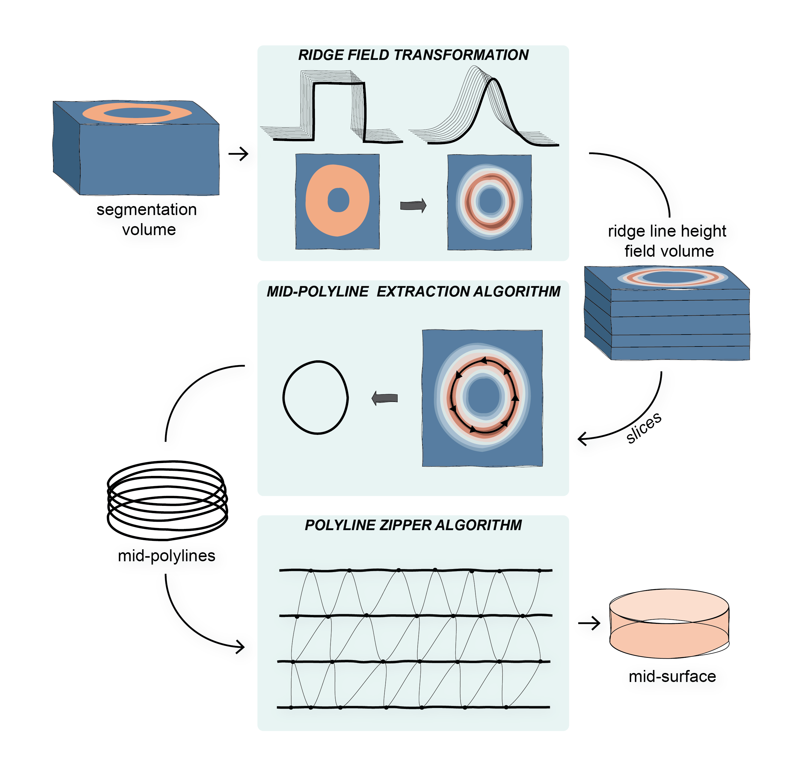

# MidSurfer - A Paraview Plugin for extracting mid-surfaces from segmentation masks


<!--toc:start-->
- [Overview](#overview)
- [Installation](#installation)
- [Using the MidSurfer Plugin](#using-the-midsurfer-plugin)
- [Data Sets](#data-sets)
- [Method](#method)
- [Publications](#publications)
<!--toc:end-->

## Overview

MidSurfer is a novel parameter-free method for extracting mid-surfaces from segmented volumetric data. Our method produces smooth, uniformly triangulated meshes that accurately capture the structural features of interest. This repository provides the source code, which can be compiled into a plugin for [ParaView](https://www.paraview.org).

The code has been tested on macOS Sonama Version 14.2.1 and Linux Ubuntu 20.04.6 LTS using ParaView 5.11.2.

## Installation

The MidSurfer plugin requires the following software:

* The [CMake](https://cmake.org/) build system, and
* [ParaView source](https://www.paraview.org/download/?filter=Sources) for building the plugin.

In order to build the MidSurfer plugin, ParaView needs to be compiled from sources manually using these
[CMake instructions](https://gitlab.kitware.com/paraview/paraview/-/blob/master/Documentation/dev/build.md).

The MidSurfer plugin can be installed using the standard CMake procedure:

1. Create a build folder
2. Launch CMake with this repository as source folder
3. Configure the project with `-DParaView_DIR=<path to ParaView build folder>`.

## Using the MidSurfer Plugin

Once the plugin has been built, it can be loaded via `Tools->Manage Plugins...`, pressing `Load New..` and selecting the plugin binary (`MidSurfer.[so|dll]`, depending on the operating system). This adds an entry `MidSurfer` in the `Filters` menu which provides the following filters:

* `Extract Midsurface (simple)`: The basic algorithm, which can be used on segmentation masks with well defined structures (like `Fig7.vti`, `Fig13A.vti`, and `Fig13B.vti` in the data folder, corresponding to Fig.7, Fig13(A), and Fig.13(B) in the paper).
* `Extract Midsurface (advanced)`: The complete algorithm, which is slower but also works on segmentation masks with very thin structures (like `Fig11-IMM.vti`, and `Fig11-OMM.vti` in the data folder, corresponding to Fig.11 in the paper).

By toggling the advanced properties button (little gear icon on the top right in the Properties panel), parameters which are automatically set by the algorithm can be accessed for illustration and exploration of the algorithm (disclaimer: not all combinations have been tested or might even make sense).

In addition, the plugin provides the following filters, which are used in the MidSurfer algorithm itself. These filters can be used to explore individual steps of the algorithm, but might be useful as standalone filters as well:

* `Compute Connected Commponents in Binary Image`: Takes a binary (that is, with only values 0 and 1) 2D image and relabels according to the connected components (see Fig4(B) in the paper).
* `Compute Eigen Vector Field`: Takes a binary (that is, with only values 0 and 1) 2D image and computes curvature tensor and Eigenvector fields (the latter should be interpreterd as a line field). Various options for computing a smoothed height field are available for illustration. This filter is not used in the actual algorithm but used for illustrating it, see Fig.5 in the paper.
* `Extract Center Line`: Takes a binary (that is, with only values 0 and 1) 2D image and extracts the mid-polyline from each component (using the `Compute Cennected Components in Binary Image` filter). Various options for computing a smoothed height field are available for illustration. See Section 3.3 in the paper.
* `Generate Point Cloud From Segmentation Mask`: Takes a binary (that is, with only values 0 and 1) 2D /3D image and extracts the segmented pixels/voxels as a point cloud. This filter can be used to reproduce Barad et al.'s approach (ref [6] in the paper) for comparison by computing point normals and using screened Poisson Surface Reconstruction using, e.g., Meshlab or CGAL.
* `Signed Distance Field`: Takes a binary (that is, with only values 0 and 1) 2D /3D image and computes the (smoothed) signed distance field for the segmentation mask.
* `Zipper Triangulation`: Takes a line set and computes a triangulation using the Polyline Zipper Algorithm. See Section 3.4 in the paper.

## Data sets

Data sets used in the paper and summarized in Table 1 therein can be found in the [data](data/) folder.

## Method

Schematic overview of the Mid-surface Extraction algorithm, for a detailed exposition please refer to the paper.



## Publications

Eva Boneš, Dawar Khan, Ciril Bohak, Benjamin A. Barad, Danielle A. Grotjahn, Ivan Viola,  Thomas Theußl, <i>"MidSurfer: A Parameter-Free Approach for Mid-Surface Extraction from Segmented Volumetric Data"</i>, [arxiv.org preprint](https://arxiv.org/abs/2405.19339).

If you find our work useful, please consider citing our paper:
```bibtex
@article{bones2024midsurfer,
    title        = {MidSurfer: A Parameter-Free Approach for Mid-Surface Extraction from Segmented Volumetric Data},
    author       = {Bone\v{s}, Eva and Khan, Dawar and Bohak, Ciril and Barad, Benjamin A. and Grotjahn, Danielle A. and Viola, Ivan and Theu\ss{}l, Thomas},
    year         = 2024,
    doi          = {10.48550/arXiv.2405.19339},
    eprint       = {2405.19339},
    archiveprefix = {arXiv},
    primaryclass = {cs.CG}
}
